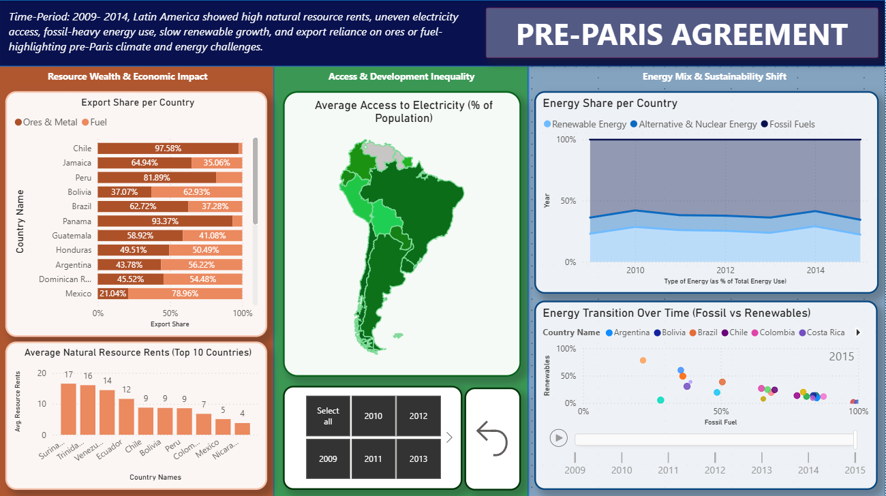
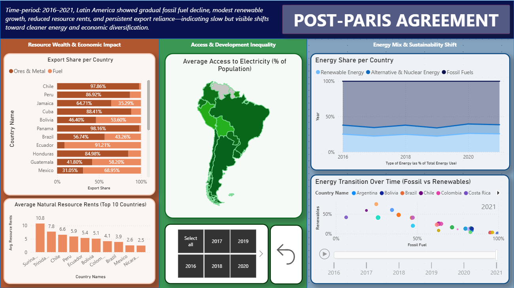

# Energy Landscape of South America: Energy Use, Resource Wealth & the Paris Agreement

## 📊 Project Overview
This Power BI dashboard analyzes the **energy landscape of South American countries** using **World Bank Indicators**, with a specific focus on **energy use, resource wealth, and exports**.  
The project places special emphasis on the **impact of the Paris Agreement (2016)** by comparing **pre-Paris (2009–2014)** and **post-Paris (2016–2021)** trends.

The dashboard highlights how countries with high natural resource dependence responded to global climate commitments, particularly in terms of **energy mix, electricity access, and export structure**.

---

## 🎯 Objectives
- Analyze **energy mix composition** (fossil fuels, renewables, alternative & nuclear)
- Compare **energy trends before and after the Paris Agreement**
- Examine **natural resource rents (% of GDP)** as a measure of resource dependence
- Study **electricity access inequality** across countries
- Understand **energy exports and economic reliance on fuels and ores**
- Assess progress toward **energy transition and sustainability**

---

## 🗂️ Dataset
- **Source:** World Bank Indicators
- **Geographical Scope:** South American countries
- **Time Period:**  
  - *Pre-Paris Agreement:* 2009–2014  
  - *Post-Paris Agreement:* 2016–2021
- **Key Indicators Used:**
  - Energy use by source
  - Fossil fuel consumption
  - Renewable energy share
  - Alternative & nuclear energy
  - Natural resource rents (% of GDP)
  - Electricity access (% of population)
  - Fuel and ore exports

---

## 🛠️ Tool Used
- **Power BI** (data modeling, DAX measures, interactive dashboards)

---

## 🔍 Dashboard Structure & Analysis

### 🟦 Pre-Paris Agreement Period (2009–2014)

**Key Observations:**
- High **natural resource rents**, indicating strong dependence on extractive industries
- Uneven **access to electricity** across countries
- Heavy reliance on **fossil fuels**
- Slow growth in renewable energy
- Export structures dominated by **ores, metals, and fuels**

**Interpretation:**  
The region faced significant **energy and climate challenges** prior to Paris, with limited diversification and high environmental risk.

---

### 🟪 Energy Landscape Overview

This section provides a **regional snapshot** of:
- Energy consumption trends
- Top energy-consuming countries
- Share of renewables, fossil fuels, and alternative energy
- Energy exports by country

---

### 🟩 Post-Paris Agreement Period (2016–2021)

**Key Observations:**
- Gradual **decline in fossil fuel dependence**
- Modest but visible **growth in renewable energy**
- Reduction in **average natural resource rents**
- Continued reliance on energy exports, though with slight diversification
- Improved **electricity access** across most countries

**Interpretation:**  
While the transition is slow, post-Paris data indicates **early movement toward cleaner energy systems and economic diversification**.

---

## 📈 Key Insights
- Energy transition in South America is **incremental rather than rapid**
- Countries with high resource wealth show **slower structural change**
- Renewable growth exists but remains **insufficient to offset fossil dependence**
- Electricity access has improved, but **development inequality persists**
- The Paris Agreement appears to have influenced **policy direction**, though implementation varies widely

---

## 🌍 Policy & Research Relevance
This dashboard is useful for:
- Climate and energy policy analysis
- Sustainability and ESG research
- Development economics studies
- Comparing international climate commitments with actual outcomes
- Understanding challenges faced by resource-rich economies

---

## 📌 Conclusion
The dashboard demonstrates how **global climate agreements like the Paris Agreement influence—but do not immediately transform—energy systems**.  
South America shows signs of progress, but structural dependence on fossil fuels and natural resources remains a key challenge for achieving long-term sustainability.

---

## 👤 Author
**Chetan Raj**  
Data Analytics & Sustainability Studies  
TISS Mumbai
