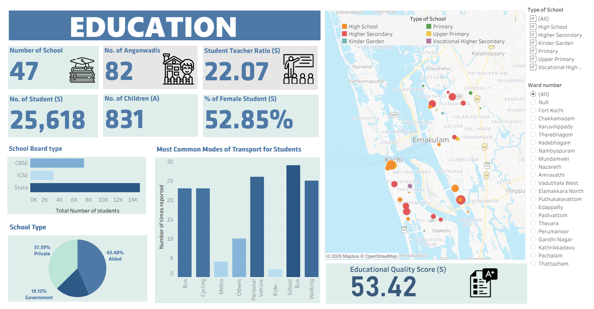
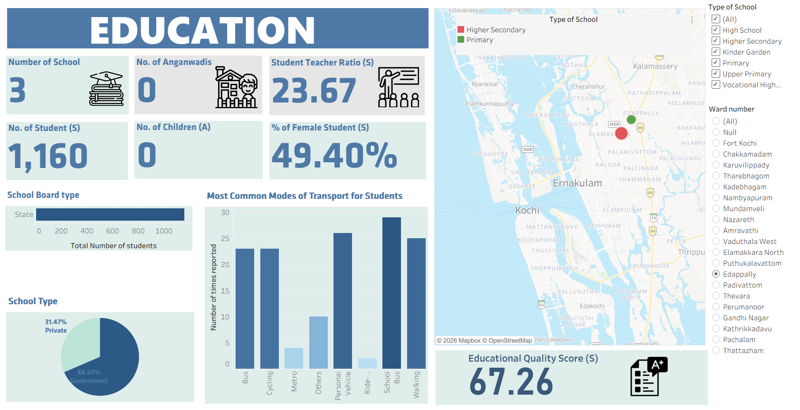

# Education Infrastructure & Outcomes – Ward Level Analysis (Kochi, India)

## 📌 Project Overview
This project presents an interactive **Tableau dashboard** analysing the **education infrastructure, access, and quality** at the **ward level in Kochi (Cochin), India**.  
The dashboard is built using **primary data collected during fieldwork**, making it a ground-level, data-driven representation of the education ecosystem across different wards of the city.

---

## 🎯 Objectives
The key objectives of this dashboard are to:
- Assess the **distribution of educational institutions** across wards
- Analyse **student enrollment and gender composition**
- Examine **student–teacher ratios** as an indicator of educational capacity
- Understand **modes of transport used by students**
- Compare **school types and board affiliations**
- Provide a **ward-level spatial view** to identify disparities in access and quality

---

## 🗂️ Data Description
- **Data Type:** Primary data
- **Source:** Fieldwork and on-ground data collection
- **Geographical Scope:** Kochi (Cochin), Kerala, India
- **Granularity:** Ward-level
- **Key Entities Covered:**
  - Schools
  - Anganwadis
  - Students and children
  - Teachers
  - Transport modes
  - School management and board types

---

## 🛠️ Tool Used
- **Tableau** (for data visualisation and interactive dashboard creation)

---

## 📊 Key Metrics Displayed
- Number of Schools
- Number of Anganwadis
- Total Number of Students
- Number of Children
- Student–Teacher Ratio
- Percentage of Female Students
- Educational Quality Score

---

## 📈 Dashboard Features
- **Ward-level filter** for granular analysis
- **School type filter** (Primary, Upper Primary, High School, Higher Secondary, etc.)
- Interactive **map visualization** showing spatial distribution of schools
- KPI cards for quick insights
- Charts showing:
  - School board distribution
  - School management type (Government / Aided / Private)
  - Student transport modes
- Composite **Educational Quality Score** indicator

---

## 🖼️ Dashboard Preview

### Education Dashboard Overview

### Ward Level Distribution

